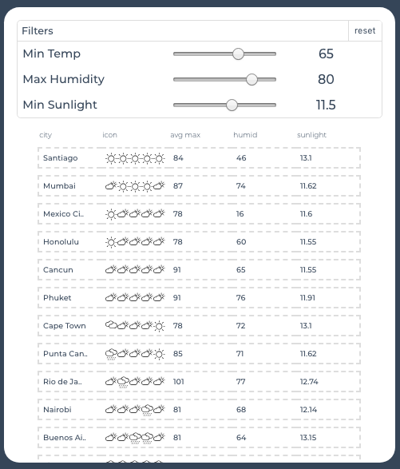
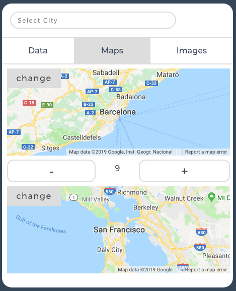
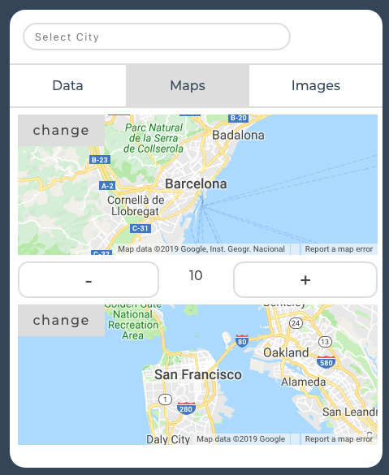
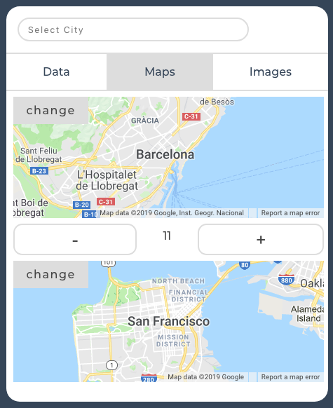
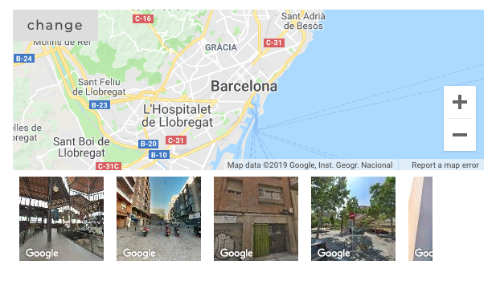
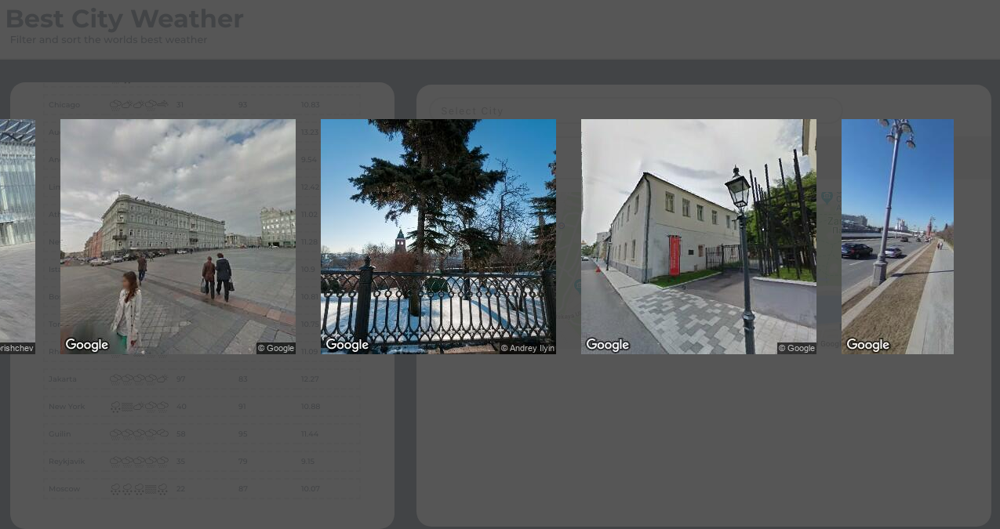

## Intro

Find the best weather forcast from the most frequently traveled worldwide tourist destinations.

[https://best-world-weather.herokuapp.com/](https://best-world-weather.herokuapp.com/).


Apply filters and sort acording to your preferences



Synchronized zoom between two cities allows you to compare the size of your destination with a city you are familar with.

<!--  -->



<!--  -->

See random images from googles static images api to see what the city actually looks like.

Images are randomly generated from within the geocoordinates inside the edge boundries of the map.

Zoom or drag the map to generate new images.



Use the jumbo view to enlarge the images and add more from within the same boundries.




## To Start

Manually load necessary api keys prior to starting the app or place in a bash file.
These need to also be added to Heroku config before deployment.

```
$ export GOOGLE_API_KEY=xxxxxxxxxxxxxxxxxxxxxxxxxxxxxxxxxxxxxxx
$ export REACT_APP_GOOGLE_API_KEY=xxxxxxxxxxxxxxxxxxxxxxxxxxxxxxxxxxxxxxx
$ export DARKSKY_API_KEY=xxxxxxxxxxxxxxxxxxxxxxxxxxxxxxxx 
```

Uncomment getForcasts('initialize') to seed the database in the api/index.js file.

This should only be run on first setting up the database or after the db has been droped.

getForcasts('update'); can be used to update the database with the current weather info and automatically called at set intervals.


```
api/index.js

getForcasts('initialize') // only run after db.forcasts.drop()
getForcasts('update');
```


#### start the client and api

api runs on http://localhost:8080

```
./

$ npm start
```

client server runs on http://localhost:8081

```
./client

$ npm start
```


